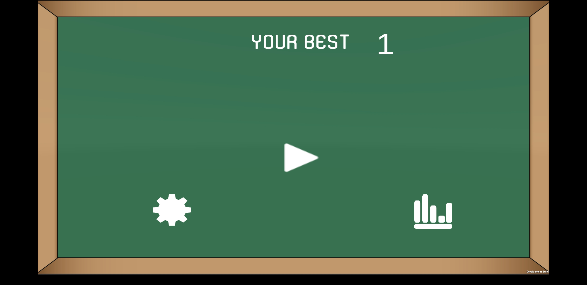
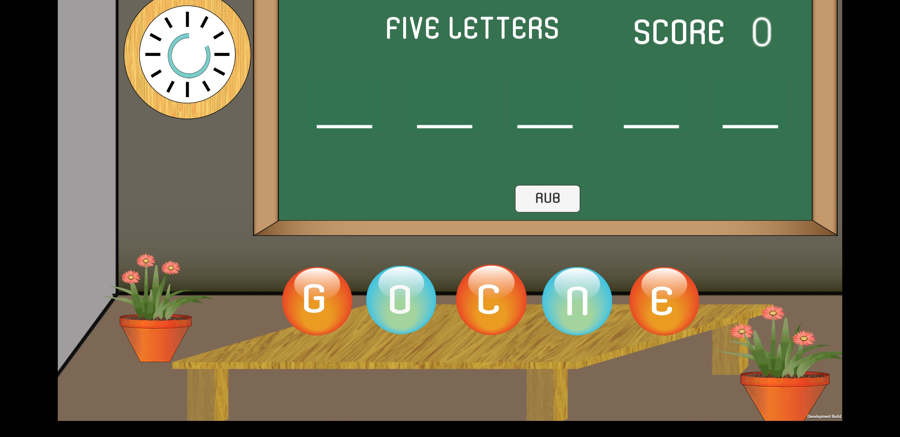
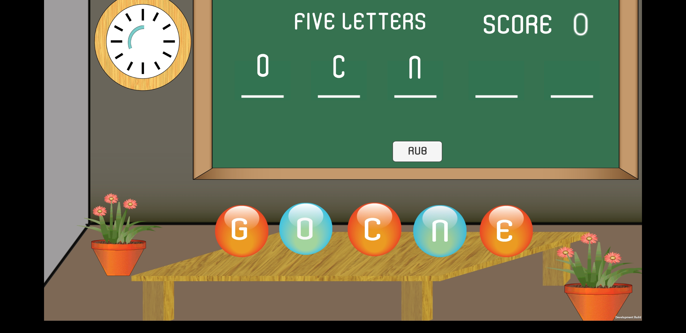
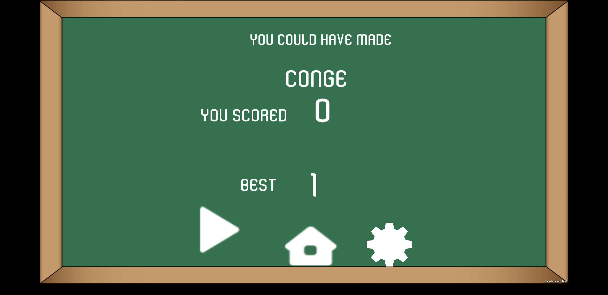
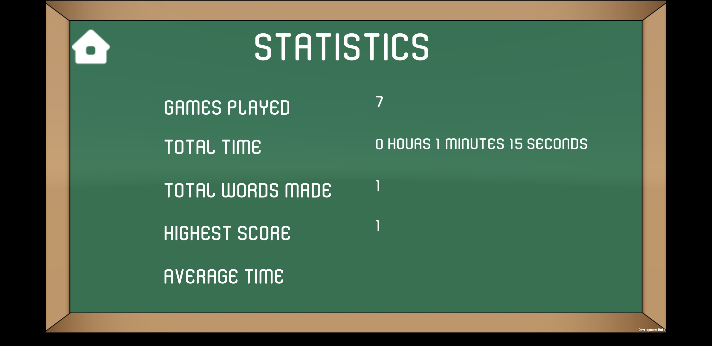

# Five-Letters
Game is written in C# using Unity Game Engine. The game has a classroom setting where you will get 5 jumbled characters on a table. You have to quickly select characters before the time runs out in the order to make a meaningful word. Each correct answer fetches you 1 point and takes you to the next round. Score as high as possible!  

You can download the apk from here on your android phone https://github.com/pratush07/Five-Letters/blob/master/fiveletters/fiveletters.apk . 

1. When the App starts you  will see this screen for a few moments and then will be directed to home screen.  

  

2. Here you can see 3 options. The Play button is playing. The settings button is for setting sound On/Off.  

3.After clicking on play button, you will be taken to the classroom. On the table are some letters jumbled up. On the top left corner, there a clock timer running.

4. Select the characters in order to make a meaningful word before the timer runs out. To quickly remove the characters click on rub on the board to select the characters again.

5. If you are unable to make the word under the time limit, the game ends. You will be taken to the scoring screen.

6. To see the stats, go back to the home page and click on charts button

